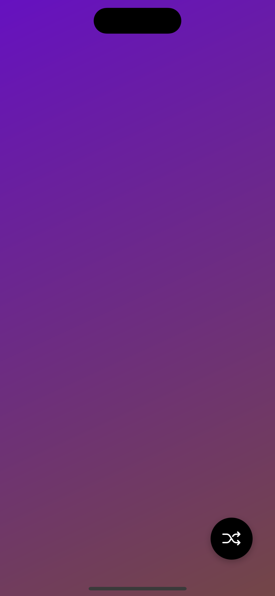

# Proyecto base usando [**Skia**](https://shopify.github.io/react-native-skia/) y [**React Native Reanimated**](https://docs.swmansion.com/react-native-reanimated/) en [**React Native**](https://reactnative.dev).

## Configuraciones iniciales

**Tener listo**: [React Native - Environment Setup](https://reactnative.dev/docs/environment-setup) antes de continuar.

## Descargar el proyecto e instalar las dependencias

```bash
npm i
```

## Iniciar la app

### Android

```bash
# usando npm
npm run android
```

### iOS

```bash
# usando npm
npm run ios
```

## Vista previa

## Android

&nbsp; &nbsp;

## iOS

&nbsp; &nbsp;

## Errores (Troubleshooting)

Error de `Error: [Reanimated] valueUnpacker is not a worklet...`

[Solución en Stack Overflow](https://stackoverflow.com/questions/67130651/reanimated-2-failed-to-create-a-worklet-maybe-you-forgot-to-add-reanimateds-b)

Happy hacking !
